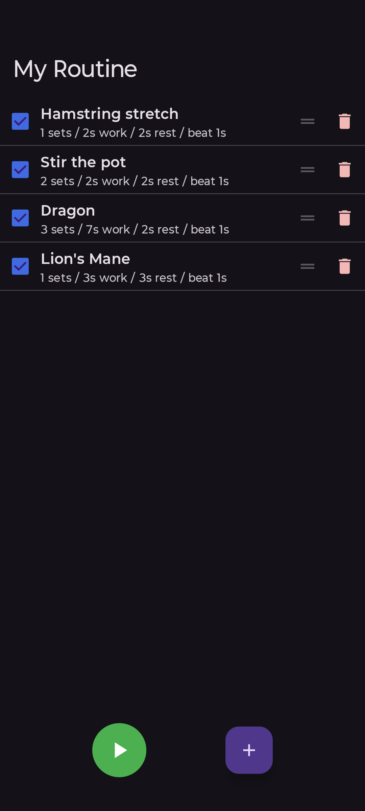
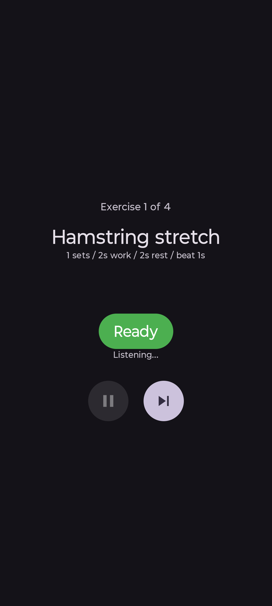

# Exercise Counter

An Android workout timer that runs a list of exercises back-to-back, keeping the beat with a metronome and announcing progress aloud so you can focus on moving instead of watching a screen.

<p align="center">
  &nbsp;&nbsp;&nbsp;&nbsp;
  &nbsp;&nbsp;&nbsp;&nbsp;
  
</p>

## What it does

You build a **routine** — an ordered list of exercises, each with its own set count, work duration, rest gap, and metronome beat interval. Hit Play and the app walks you through every exercise in sequence:

1. Announces the exercise name, set count, and duration aloud.
2. Waits for you to signal **Ready** (by voice or tap).
3. Clicks a woodblock metronome throughout each work interval.
4. Announces the completed set number after each set.
5. Silently times the rest gap between sets.
6. Repeats until all sets are done, then moves to the next exercise.
7. Announces "Routine complete" when everything is finished.

## Voice-activated start — hands-free between exercises

When transitioning to a new exercise — or to the first set — the app stops and waits for you to say you're ready. The screen shows a **"Listening…"** indicator and a tap-to-ready button as a fallback.

**To trigger hands-free, say any of:**
> **"ready"** · **"go"** · **"next"** · **"okay"** · **"ok"** · **"when"**

The microphone stays open and listening until it hears one of those words anywhere in a phrase. You don't need to aim the phone at your mouth or wait for a tone — just say the word naturally, mid-movement:

- *"Okay, go"*
- *"I'm ready"*
- *"Let's go"*
- *"When"* (start when I say when)

The moment the word is detected, the metronome starts for the next set. No hands required.

If your device doesn't support offline speech recognition, the app falls back silently to tap-only mode with no other change in behavior.

## Repositioning between exercises

When one exercise finishes and the next is announced, you have **unlimited time to get into position**. The app is waiting — it will not start the next exercise until you trigger it. Use that window to:

- Walk to a different piece of equipment
- Change grip or stance
- Catch your breath beyond the programmed rest gap

Once you're set, say **"ready"** (or tap the button) and the metronome starts immediately for the first set of the new exercise.

If you need to jump to the next exercise early — say an exercise doesn't feel right or doesn't apply today — tap the **Skip** button (⏭) at any time. It abandons the remaining sets for the current exercise and jumps straight to the next one's ready prompt.

## Routine setup

### Building a routine

The routine screen shows your exercise list. Each exercise has:

| Field | What it means |
|-------|--------------|
| **Name** | Announced aloud at the start of each exercise |
| **Sets** | Number of work intervals |
| **Work** | Duration of each work interval (seconds) |
| **Rest** | Gap between sets within this exercise (seconds) |
| **Beat** | Metronome tick interval in seconds; 0 disables it |

Tap **+** to add an exercise. Tap any exercise to edit it. Long-press and drag the **⠿** handle to reorder. The checkbox on each row enables or disables that exercise without deleting it — useful for days when you're skipping certain movements.

The Play button is only enabled when at least one exercise is checked.

### Playback controls

| Control | What it does |
|---------|-------------|
| **Pause / Resume** | Freezes mid-interval, preserving the exact time remaining in the current set or rest gap |
| **Skip ⏭** | Abandons the current exercise and moves to the next one's ready prompt |
| **Ready** | Tap to start the next set when voice isn't available or you prefer tap |
| **Done** | Appears when the routine finishes; returns to the routine list |

Pause is disabled while the app is waiting for your ready signal — there's nothing running to pause.

## Requirements

- Android 10 (API 29) or later
- A physical device is recommended — the metronome uses `AudioTrack` and TTS uses the system speech engine, both of which benefit from real hardware audio

## Build

```bash
./gradlew assembleDebug
./gradlew installDebug
```

## Tech stack

- Kotlin, Jetpack Compose, Material 3
- Room database for routine persistence
- `AudioTrack` with synthesized PCM woodblock sound for the metronome
- Android `TextToSpeech` for voice announcements
- `SpeechRecognizer` for hands-free voice activation
- `SavedStateHandle` for state persistence across config changes and process death

## License

Open source. See [LICENSE](LICENSE) for details.
