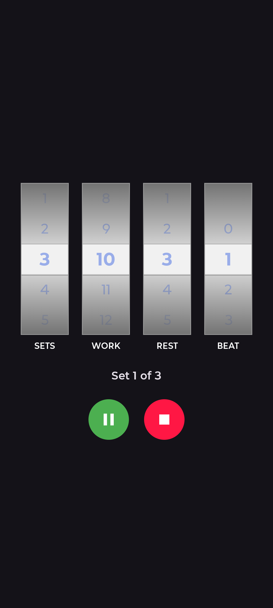

# Exercise Counter

An Android app that counts timed exercise sets for you. Configure your workout, press play, and the app handles the timing -- a metronome ticks during each set, a voice announces completed sets, and rest gaps are timed automatically.

<p align="center">
  
</p>

## How It Works

Set four values using the scroll wheel pickers:

| Picker | What it controls | Range |
|--------|-----------------|-------|
| **SETS** | Number of exercise repetitions | 1--20 |
| **WORK** | Duration of each set in seconds | 1--99 |
| **REST** | Rest gap between sets in seconds | 1--30 |
| **BEAT** | Metronome tick interval in seconds (0 = off) | 0--9 |

Press **Play** to start. The app cycles through each set:

1. Metronome ticks at the beat interval for the work duration.
2. A voice announces the completed set number.
3. The app rests silently for the gap duration.
4. Repeat until all sets are done.

Press **Pause** to stop mid-set -- the timer preserves your position and resumes where you left off. Press **Reset** to start over.

## Building

Standard Android Studio project. Clone the repo, open in Android Studio, and run on a device or emulator (minSdk 29 / Android 10+).

```
git clone https://github.com/your-username/Exercise_Counter.git
```

## Tech Stack

- Kotlin, Jetpack Compose, Material 3
- `AudioTrack` with synthesized PCM audio for the metronome
- Android `TextToSpeech` for voice announcements
- `SavedStateHandle` for state persistence across config changes

## License

Open source. See [LICENSE](LICENSE) for details.
